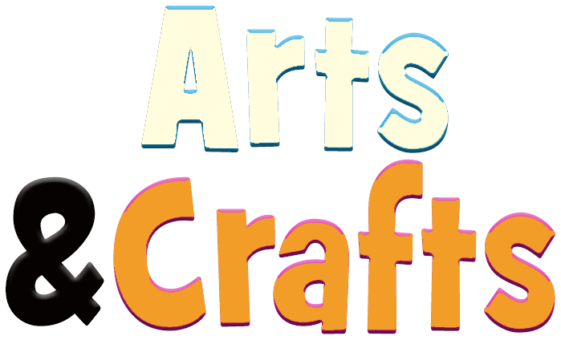

1. Top bar 
 ```html
 <div id="topbar" class="fixed-top">
        <div class="container">
            <h4 class="top-bar-text">
                <p>֍ SAATMISE TASU EESTIS al. 2,90 €    ֍    TASUTA SAATMINE OSTUDELE ALATES 50 € ֍</p>
            </h4>
            <p class="top-bar-text">SOOME SAADAME KAUPA ITELLA SmartPost "posti" PAKIAUTOMAATI ֍ MAKSEVALIKUS SOOME PANGALINGID</p>
        </div>
    </div>
```
2. Logo muuta + Right menu jääb samaks
```html
<!-- Header Section -->
    <header>
        <div class="container top-header">
            <a href="index.html" class="logo">
                
            </a>
            <nav class="top-menu">
                <ul>
                    <li><a href="minu-konto.html">Logi sisse</a></li>
                    <li><a href="transport.html">Transport</a></li>
                    <li><a href="kkk.html">KKK</a></li>
                </ul>
            </nav>
        </div>

        <!-- Hamburger Icon for Mobile Menu -->
        <div class="hamburger" onclick="toggleMenu()">
            <span></span>
            <span></span>
            <span></span>
        </div>
```
3.
